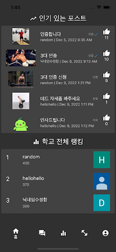
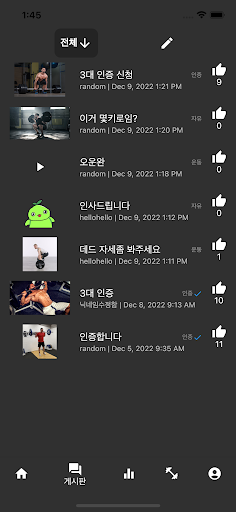
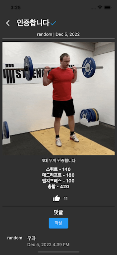
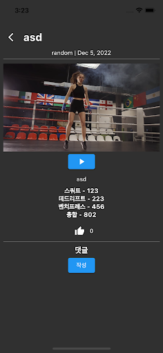
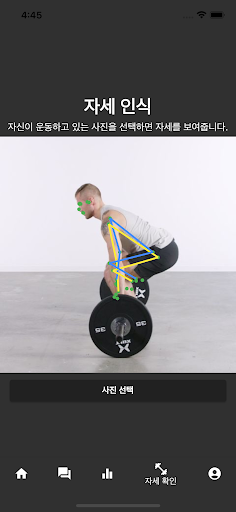
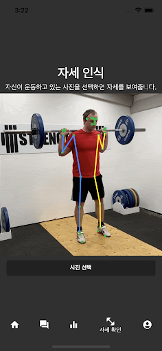
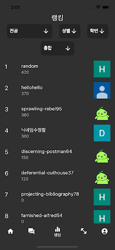
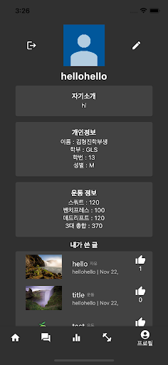

# 강한 한동 (Strong Handong)
나의 3대 운동 무게는 학교에서 몇번째일까? 등의 궁금증을 해결하고 운동에 관한 정보들도 얻을 수 있는 커뮤니티
## 사용 기술
Flutter, Firebase, Google ML Kit  
## 주요 기능
- Google 로그인
- 자신의 정보를 작성하고 내가 쓴 글과 댓글을 볼 수 있는 프로필
- 영상, 사진과 글을 올려 정보를 공유하고 3대 무게 인증도 받을 수 있는 게시판
- Google ML Kit를 이용한 운동 자세 분석 기능
- 전공, 성별, 학번, 운동별로 나누어 혹은 전체적으로 볼 수 있는 3대 운동 무게 랭킹
- 3대 무게 인증 글의 추천이 일정 수를 넘어가면 자동으로 해당 유저의 3대 무게를 업데이트하는 기능
## 스크린샷

